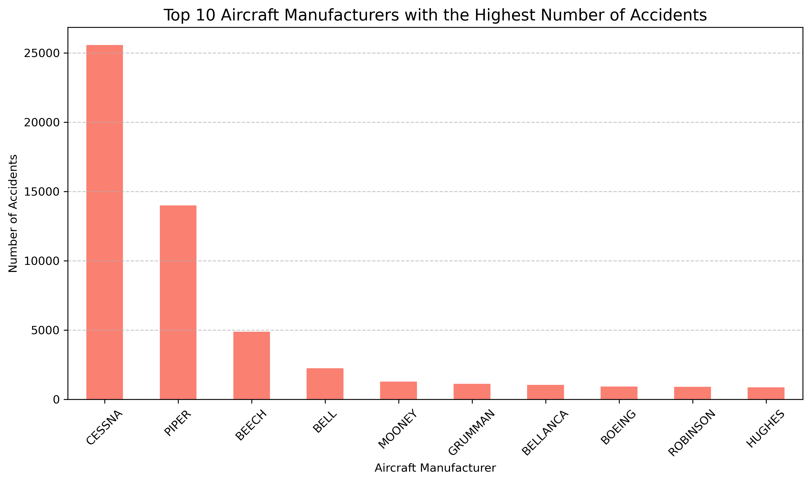
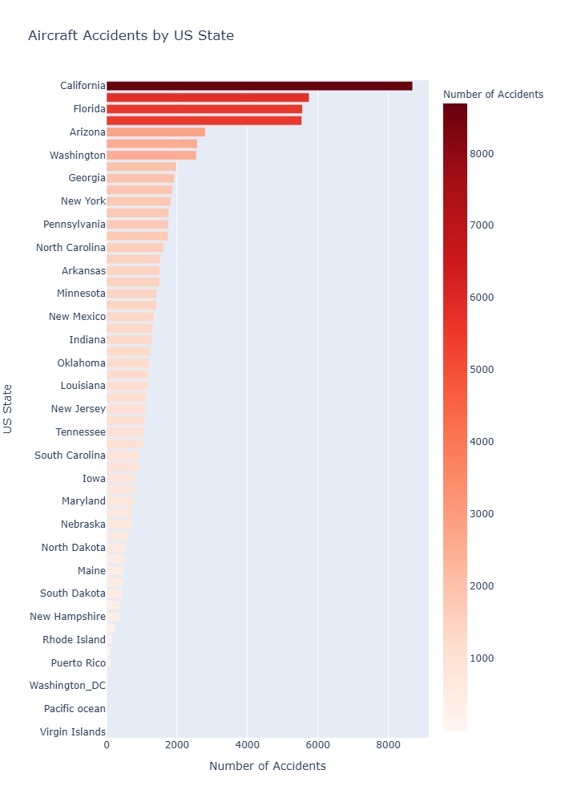

# Akademi (Flatiron School) — Data Science & AI, Cohorte 2025  
## First Project-Phase 1  
 **Student Name:** Micka LOUIS  
 **Student Pace:** Self-paced  
 **Submission Deadline:** June 8, 2025  
 **Instructors' Names:** Wedter JEROME & Geovany Batista Polo LAGUERRE  
 **Blog Post URL:** https://github.com/Micka-Louis/dsc-project-phase-1.git  

 # Project Title  
 
## US Aviation Accidents Analysis(1962-2023)   
  

# Overview  
## This notebook presents a structured analysis of aviation accident data. It follows the CRISP-DM methodology, offering insight into understanding and preparing data for decision-making in aviation safety.  

# Business Understanding    
  
Aviation safety is essential to public trust and operational efficiency. Understanding past accidents helps stakeholders identify systemic issues and implement safety improvements.  

# Business Problem  

  
The company is planning to expand into new industries as part of a broader diversification strategy. One of the targeted areas is aviation — specifically, the purchase and operation of aircraft for commercial and private services. However, the company currently lacks knowledge about the aviation industry, particularly regarding the safety and risk profiles of different aircraft.  

The objective is to identify which aircraft models present the lowest operational risk, using historical data on aircraft incidents and accidents. The goal is to provide data-driven insights that will guide the head of the new aviation division in selecting the safest and most reliable aircraft to purchase.  

To support this effort, aviation safety data will be sourced, explored, and analyzed, with the results translated into actionable business recommendations that reduce risk and support informed decision-making in this new venture.  

# Data Understanding    

Our analysis leverages the AviationData from the NTSB (1962-2023), with a focus on the 1982-2023 period to examine modern aviation safety trends. The dataset provides comprehensive attributes including accident context (date, location, aircraft details), safety metrics (injuries, weather conditions), and aircraft specifications (engine type, capacity). We evaluate accident patterns across flight phases, operator types, and geographic regions to identify high-risk scenarios, while the dataset's flexibility allows filtering by time period, injury severity, and aircraft characteristics for tailored insights. This structured approach enables us to uncover key trends, assess risk factors, and ultimately support data-driven safety improvements in aviation operations.  

# Methods  

This project uses descriptive analysis to examine trends in U.S. aviation accidents (2000–2022), including:

Temporal trends (accident/injury rates over time).  
Manufacturer comparisons (accident frequency vs. severity).  
Geographic & weather-related patterns (high-risk states, VMC/IMC conditions).  

The analysis identifies key risk factors and safety improvements, supporting data-driven decision-making for aviation stakeholders.  

# Results
  
The bar chart displays the 10 aircraft manufacturers with the lowest number of reported accidents. All other manufacturers have been grouped under 'OTHER' for clarity and simplicity. This analysis highlights a group of manufacturers with very few accident records. However, it is important to note that a low number of reported accidents does not necessarily indicate better safety performance — it may instead reflect a smaller fleet size, limited aircraft production, or infrequent operational use.

The bar chart illustrates the 10 aircraft manufacturers with the highest number of reported accidents in the dataset. These manufacturers represent a significant portion of all recorded aviation incidents. The large number of accidents reported for some manufacturers may be due to their widespread use, high production volumes, and long operational history rather than inherently lower safety standards.  

For instance, some companies produce a large number of general aviation aircraft used for training, personal flights, and commercial purposes — all of which increase exposure to accident risk over time. It is essential to consider both the number of aircraft in service and the frequency of flights when interpreting these figures, as higher accident counts often reflect broader usage rather than poor design or maintenance practices.  

This visualization helps identify manufacturers with the most exposure in aviation activities and serves as a starting point for deeper analysis into accident causes, aircraft types, and flight conditions.  

  
Conclusion: Accident frequency does not necessarily correlate with accident severity.Small manufacturers may have fewer accidents, but when accidents happen, they tend to be more serious, possibly due to limited safety features, older aircraft, or less regulatory oversight. In contrast, large manufacturers like Cessna and Piper may have more frequent accidents due to a larger fleet size, but their severity is generally lower, indicating better safety standards or more minor incidents.Boeing, however, combines both high accident frequency and high severity, which may reflect the larger size and capacity of its aircraft — a single accident can involve many people.

   
 California, Texas, and Florida have the highest number of aircraft accidents, making them higher-risk areas for aviation operations. For a company entering this industry, it’s important to factor in geographic risk when choosing where to operate. Starting in lower-risk states may reduce exposure to accidents. If expansion in these high-accident areas is necessary, strong safety measures and maintenance routines are essential. These insights should guide investment choices and aircraft purchases.

# Conclusion and Next Steps  
**a. Conclusion:**  
**Conclusion – Risk Analysis in Aviation (1982–2022)**  

Our analysis of aviation accident data in the United States from 1962 to 2022 reveals an overall improvement in aviation safety over time. The total number of accidents and injuries has decreased, partly due to technological advances, stricter regulations, and better training. However, these general trends must be nuanced by significant differences between manufacturers, aircraft types, flight conditions, and geographic areas.  

**🔎Key Takeaways:**  

**Overall decline in accidents:**  

Between 2000 and 2022, the number of accidents dropped from around **2,000 to 1,200**.The drop is especially sharp in **2020 (linked to COVID-19)**, but remains significant in the long run.Serious and fatal injuries follow a similar trajectory: skies are generally safer.  

**High-risk manufacturers (frequent incidents):**  

Manufacturers such as Cessna and Piper account for the most accidents.Their high exposure is mainly due to their heavy presence in general aviation, including training, private flights, and light commercial use. However, their severity **rates are moderate (~0.47–0.61)**, suggesting that incidents are frequent but rarely severe.  

**Low-frequency but high-severity manufacturers:**

Smaller manufacturers (e.g., Gauchat, Pelt, Hillyer) report very few accidents, but those tend to be more serious.Their severity rate can reach 2.0, meaning one to two serious injuries or fatalities per accident — likely due to older fleets, poor maintenance, or lack of oversight.  

**Special case: Boeing**

Although less frequent in the dataset (due to its focus on commercial aviation), **Boeing shows the highest severity rate (2.49)**.Each Boeing-related incident tends to affect more people, given the aircraft capacity and nature of operations. 

**Weather conditions:**  

Most accidents, including the most serious ones, occur in good weather (VMC). This challenges the assumption that bad weather is the main trigger.  

IMC accidents are more frequent among large operators — emphasizing the importance of training and advanced equipment.  

**High-risk geographic zones:**  

States like **California, Texas, and Florida** account for a large share of accidents.  

While this may reflect higher aviation activity, these regions still present increased operational risk.  

# b. ✅ Recommendations for the Company 
Start with Cessna or Piper models: although frequently involved in accidents, they present lower per-accident risk and benefit from strong documentation and maintenance support.  

**1. Avoid** lesser-known small manufacturers: despite their low accident frequency, severity risk is higher, and safety standards may be less stringent.  

**2. Strengthen pilot training** for both VMC and IMC conditions, since most accidents occur in good weather — pointing to human error or technical failure.  

**3. Prioritize** operations in states with a lower accident history. If operations in California, Texas, or Florida are necessary, implement enhanced safety protocols.  

# c. 🚀 Next Steps  
Calculate accident rates per 1,000 flight hours or per 100 aircraft in service (if data is available) to enable fairer comparisons.Deepen analysis by aircraft model, not just manufacturer, to identify the most reliable specific aircraft.Study the most frequent accident causes (e.g., human error, mechanical failure, flight conditions) to pinpoint avoidable risks.Create a "Severity x Frequency" matrix to visualize trade-offs between accident frequency and severity, guiding aircraft purchasing decisions toward controlled-risk models.  

Analyze maintenance costs by manufacturer/model to align safety with economic sustainability.  

# For More Information  
See the full analysis in the Jupyter Notebook or review this presentation.  

For additional info, contact Micka LOUIS at mickalouis25@gmail.com  

# Repository Structure  
├── data
├── images
├── README.md
├── Final_Presentation.pdf
└── Final.ipynb
​

