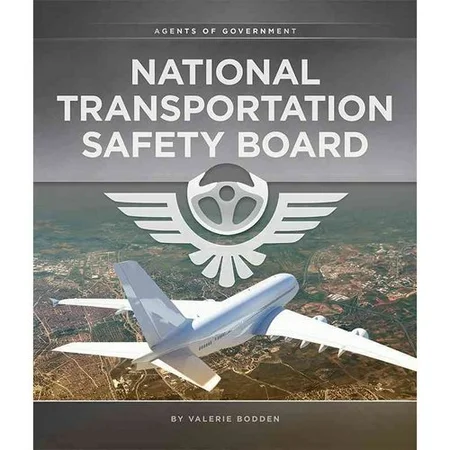
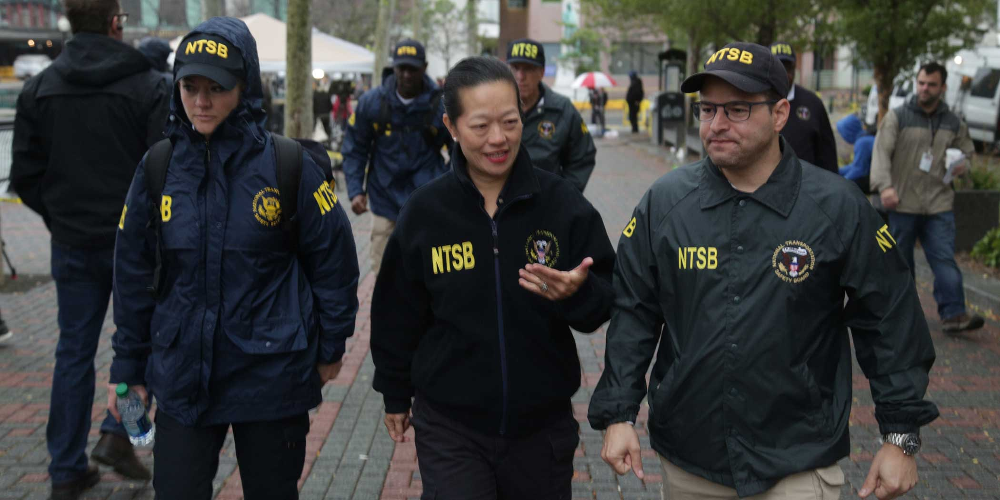
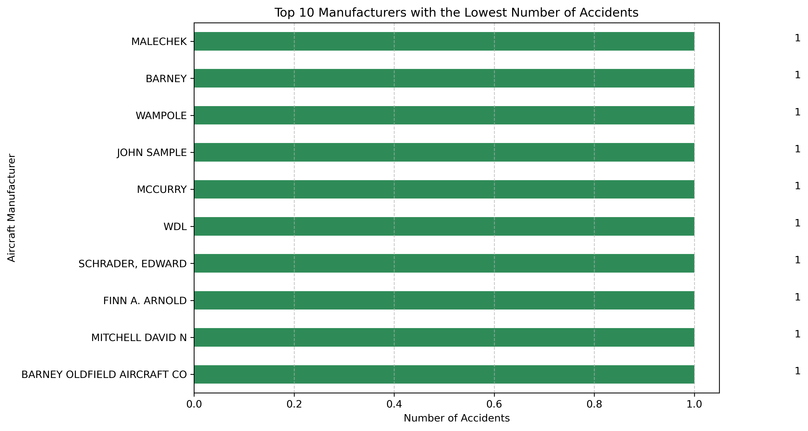
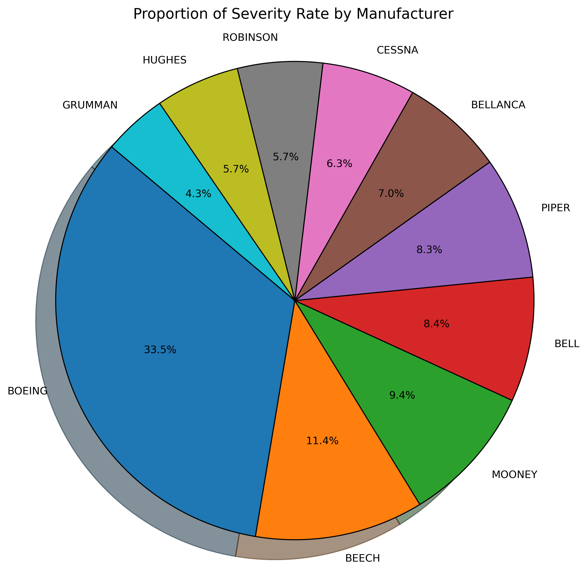

# Akademi (Flatiron School) — Data Science & AI, Cohorte 2025  
## First Project-Phase 1  
 **Student Name:** Micka LOUIS  
 **Student Pace:** Self-paced  
 **Submission Deadline:** June 8, 2025  
 **Instructors' Names:** Wedter JEROME & Geovany Batista Polo LAGUERRE  
 **Blog Post URL:** https://github.com/Micka-Louis/dsc-project-phase-1.git  

 #Project Title  
 
##US Aviation Accidents Analysis(1962-2023)   
  

#Overview  
##This notebook presents a structured analysis of aviation accident data. It follows the CRISP-DM methodology, offering insight into understanding and preparing data for decision-making in aviation safety.  

# Business Understanding    
  
Aviation safety is essential to public trust and operational efficiency. Understanding past accidents helps stakeholders identify systemic issues and implement safety improvements.  

# Business Problem  

  
The company is planning to expand into new industries as part of a broader diversification strategy. One of the targeted areas is aviation — specifically, the purchase and operation of aircraft for commercial and private services. However, the company currently lacks knowledge about the aviation industry, particularly regarding the safety and risk profiles of different aircraft.  

The objective is to identify which aircraft models present the lowest operational risk, using historical data on aircraft incidents and accidents. The goal is to provide data-driven insights that will guide the head of the new aviation division in selecting the safest and most reliable aircraft to purchase.  

To support this effort, aviation safety data will be sourced, explored, and analyzed, with the results translated into actionable business recommendations that reduce risk and support informed decision-making in this new venture.  

# Data Understanding    

Our analysis leverages the AviationData from the NTSB (1962-2023), with a focus on the 1982-2023 period to examine modern aviation safety trends. The dataset provides comprehensive attributes including accident context (date, location, aircraft details), safety metrics (injuries, weather conditions), and aircraft specifications (engine type, capacity). We evaluate accident patterns across flight phases, operator types, and geographic regions to identify high-risk scenarios, while the dataset's flexibility allows filtering by time period, injury severity, and aircraft characteristics for tailored insights. This structured approach enables us to uncover key trends, assess risk factors, and ultimately support data-driven safety improvements in aviation operations.  

# Methods  

This project uses descriptive analysis to examine trends in U.S. aviation accidents (2000–2022), including:

Temporal trends (accident/injury rates over time).  
Manufacturer comparisons (accident frequency vs. severity).  
Geographic & weather-related patterns (high-risk states, VMC/IMC conditions).  

The analysis identifies key risk factors and safety improvements, supporting data-driven decision-making for aviation stakeholders.  

# Results
  
The bar chart displays the 10 aircraft manufacturers with the lowest number of reported accidents. All other manufacturers have been grouped under 'OTHER' for clarity and simplicity. This analysis highlights a group of manufacturers with very few accident records. However, it is important to note that a low number of reported accidents does not necessarily indicate better safety performance — it may instead reflect a smaller fleet size, limited aircraft production, or infrequent operational use.

  
Conclusion: Accident frequency does not necessarily correlate with accident severity.Small manufacturers may have fewer accidents, but when accidents happen, they tend to be more serious, possibly due to limited safety features, older aircraft, or less regulatory oversight. In contrast, large manufacturers like Cessna and Piper may have more frequent accidents due to a larger fleet size, but their severity is generally lower, indicating better safety standards or more minor incidents.Boeing, however, combines both high accident frequency and high severity, which may reflect the larger size and capacity of its aircraft — a single accident can involve many people.
